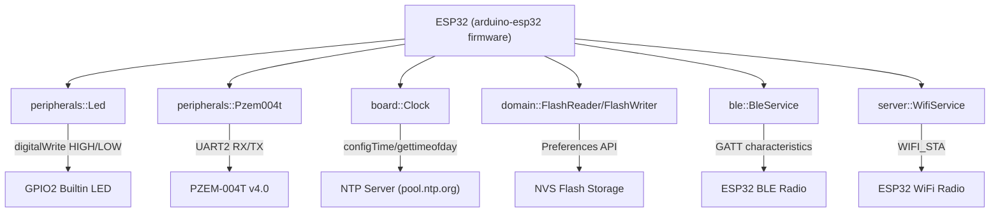
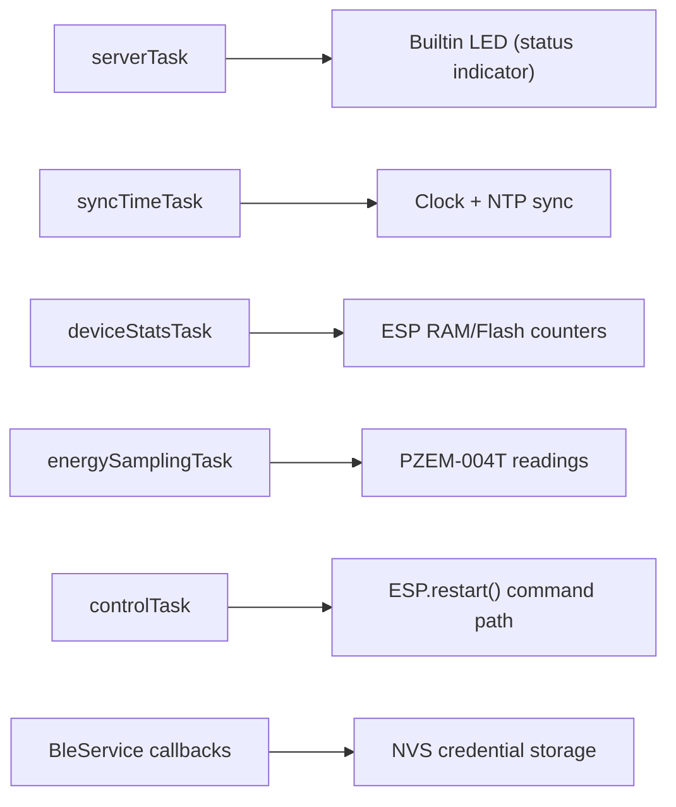

# Peripherals Diagram

This document identifies the board peripherals and how firmware components interact with them.

## Hardware Interaction Map

```mermaid
flowchart TD
esp32["ESP32 (arduino-esp32 firmware)"]

ledClass["peripherals::Led"] -->|"digitalWrite HIGH/LOW"| ledPin["GPIO2 Builtin LED"]
pzemClass["peripherals::Pzem004t"] -->|"UART2 RX/TX"| pzemSensor["PZEM-004T v4.0"]
clockClass["board::Clock"] -->|"configTime/gettimeofday"| ntpServer["NTP Server (pool.ntp.org)"]
flashRw["domain::FlashReader/FlashWriter"] -->|"Preferences API"| nvsFlash["NVS Flash Storage"]
bleService["ble::BleService"] -->|"GATT characteristics"| bleRadio["ESP32 BLE Radio"]
wifiService["server::WifiService"] -->|"WIFI_STA"| wifiRadio["ESP32 WiFi Radio"]

esp32 --> ledClass
esp32 --> pzemClass
esp32 --> clockClass
esp32 --> flashRw
esp32 --> bleService
esp32 --> wifiService
```

## Peripheral Usage by Runtime Tasks

```mermaid
flowchart LR
serverTask["serverTask"] --> ledPeripheral["Builtin LED (status indicator)"]
syncTimeTask["syncTimeTask"] --> clockPeripheral["Clock + NTP sync"]
deviceStatsTask["deviceStatsTask"] --> ramFlashInfo["ESP RAM/Flash counters"]
energyTask["energySamplingTask"] --> pzemPeripheral["PZEM-004T readings"]
controlTask["controlTask"] --> restartPeripheral["ESP.restart() command path"]
bleProvisioning["BleService callbacks"] --> nvsPeripheral["NVS credential storage"]
```
