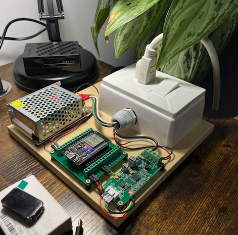

# alpha

`alpha` is Volttio’s **internal lab firmware**—the first place we try out how a device should feel in the field: **simple onboarding**, **reliable connectivity**, and **useful data** (what the hardware is doing and how much energy is flowing) sent to your own cloud stack.

You **pair once over Bluetooth** to give the board your Wi‑Fi and broker details; after that it stays online, streams **device health** and **energy metrics** over MQTT, and accepts basic remote commands (for example restart or “are you there?”). It is meant to **de-risk** product decisions before we lock a final SKU—behavior and BOM may still move.

**For engineers:** implementation details (stack, tasks, pins, build steps) are in **Architecture** and `platformio.ini`. Typical dev flow: open in PlatformIO, build/flash the `esp32dev` environment, serial at `115200` baud.

---

## Status

This repository is **internal to Volttio** and serves as a **firmware sketchpad**, not a released product:

- **Internal only** — Documentation and APIs may change without a public changelog; it is meant for engineering discussion inside the org.
- **Not a commercial SKU** — No promise of certification, long-term support, or stable hardware mapping; the BOM is “what we use on the bench.”
- **Early baseline** — Intended for experiments (connectivity, MQTT topics, sampling) and as a template for future device variants. When behavior stabilizes, expect a separate product repo or a tagged release rather than this package staying the single source of truth forever.

---

## Current Hardware Focus

The hardware described here is the **reference bench setup** used while developing `alpha`. It is **not** an exhaustive electrical design or safety guide—follow your local rules for mains and isolation when using the PZEM on real installations.

### Prototype assembly

Bench photo of the current prototype (ESP32 on a breakout, switching PSU, AC box with outlet and switch, interconnect PCB, and OLED module on its packaging):



### Microcontroller

- **Board:** DEVKIT-ESP32S-30PIN-CH340 (USB‑serial via CH340).
- **Why this class of MCU:** ESP32 gives **Wi‑Fi**, **Bluetooth LE**, and enough RAM/flash for **ArduinoJson**, **Async MQTT**, and **BLE provisioning** in one chip—aligned with the firmware’s networking stack.
- **Firmware layout:** `platformio.ini` uses the `esp32dev` board, `huge_app` partition scheme, and pulls in `AsyncMqttClient`, ArduinoJson, and the PZEM library. See `lib_deps` there for exact versions.
- **Purchase link:** [Electrónicas I+D](https://www.didacticaselectronicas.com/shop/devkit-esp32s-30pin-ch340-tarjeta-de-desarrollo-devkit32-esp32s-ch340-39069?search=esp32+30+pin&order=name+asc#attr=)

### Power supply

- **Part:** Switched (switching) **5V 2A 10W** supply (e.g. S‑10‑5 class), used to power the **dev board** from mains (110–220V AC input per vendor).
- **Why call it out:** The README documents the **bench supply** so others can reproduce the same voltage/current headroom; the ESP32 dev board is typically fed from USB or 5V—match the **board’s** input requirements and polarity.
- **Purchase link:** [Electrónicas I+D](https://www.didacticaselectronicas.com/shop/s-10-5-fuente-suicheada-5v-2a-10w-3053?search=fuente+5V+2A&order=name+asc#attr=2031,2032,2034,2035,2038,2036,2037,2033)

### Sensors

#### Voltmeter and Ammeter (PZEM-004T)

- **Model:** PZEM‑004T **v4.0** 100A variant (modbus over **UART**).
- **In firmware:** The `PZEM004Tv30` driver talks to the module on **`Serial2`** (see `PZEM_UART_RX_PIN` / `PZEM_UART_TX_PIN` in `config.h`, currently `16` / `17`). Energy readings are sampled periodically and published as JSON on the MQTT **energy-stats** subject.
- **Integration note:** Follow the PZEM wiring for **voltage/current** and **mains safety**; the README does not replace the module datasheet or installation codes.
- **Purchase link:** [Electrónicas I+D](https://www.didacticaselectronicas.com/shop/pzem-004t-voltimetro-amperimetro-4-en-1-con-interfaz-rs485-13976?search=pzem004t&order=name+asc#attr=)

## Architecture

This project follows a modular firmware structure around `src/main.cpp`, where runtime orchestration is implemented using FreeRTOS tasks, event queues, and a server status state machine.

### Folder structure

```text
alpha/
├── README.md
├── platformio.ini
├── include/
│   ├── config.h
│   └── secrets.h
├── src/
│   ├── main.cpp
│   ├── board/
│   │   ├── clock.h / clock.cpp
│   │   └── stats.h / stats.cpp
│   ├── ble/
│   │   ├── ble.h
│   │   └── ble.cpp
│   ├── domain/
│   │   ├── connection.h
│   │   ├── fibonacci.h / fibonacci.cpp
│   │   └── flash_memory.h / flash_memory.cpp
│   ├── peripherals/
│   │   ├── led.h / led.cpp
│   │   └── pzem004t.h / pzem004t.cpp
│   └── server/
│       ├── server.h
│       ├── wifi_.h / wifi_.cpp
│       └── mqtt.h / mqtt.cpp
└── assets/
    └── architecture/
        ├── README.md
        ├── class-diagram.md
        ├── network-diagram.md
        └── peripherals-diagram.md
```

### Module guide

This layout matches the `build_flags` include paths in `platformio.ini` (flat includes from `main.cpp`). Use it to find **where to change behavior** vs **where data is stored**.

- **`include/`** — Build-time configuration not tied to a single `.cpp` file.
  - `config.h`: MQTT subject/command strings, sampling interval, UART and LED pins, FreeRTOS task **cores, priorities, stack sizes, delays**, queue depths, BLE GATT UUIDs, NTP server name, timezone offsets. Most tunables for experiments live here.
  - `secrets.h`: `DEVICE_ID` (MQTT client id / topic prefix segment and BLE service UUID argument). Keep real deployments out of version control if credentials grow beyond that.

- **`src/main.cpp`** — Single entry point: constructs global service pointers, creates both MQTT queues, starts BLE advertising, pins five FreeRTOS tasks to cores, and leaves `loop()` empty. It does **not** include `domain/` headers; it talks to `domain` only **through** `server` and `ble` implementations.

- **`src/board/`** — Non-network “platform” concerns: **`Clock`** calls `configTime` for NTP and formats wall-clock strings for JSON timestamps; **`Stats`** serializes flash/heap/uptime/reset reason with ArduinoJson. Neither module opens sockets.

- **`src/ble/`** — One-way **credential provisioning** over BLE: a phone or laptop writes SSID, WiFi password, and MQTT broker fields into NVS via `FlashWriter`. After provisioning, WiFi/MQTT services read the same keys. BLE stays available alongside WiFi/MQTT (no power-down in current code).

- **`src/domain/`** — Shared primitives: **`IConnectionHandler`** for `WifiService` / `MqttService`, **`Fibonacci`** delays between WiFi/MQTT retry attempts, **`FlashReader`/`FlashWriter`** on top of `Preferences`. No tasks are defined here.

- **`src/peripherals/`** — Thin wrappers: **`Led`** drives the status GPIO; **`Pzem004t`** owns `PZEM004Tv30` on `Serial2` and emits energy JSON. Pin choices come from `config.h`.

- **`src/server/`** — Connectivity stack: **`WifiService`** / **`MqttService`** implement `IConnectionHandler`, read credentials from NVS, and wrap ESP32 WiFi and `AsyncMqttClient`. **`server.h`** defines **`ServerStatus`** (the state `main.cpp` switches on). **`MqttService`** also adapts broker topics (`getBaseTopic()` + subject) and forwards inbound MQTT to the subscription queue.

- **`assets/architecture/`** — Human-readable diagrams (Mermaid) and a small index; optional for builds.

### Architecture diagrams

The diagrams are **source** for reviews and onboarding—they are not generated from code. Use them as follows:

| Document | What it answers | Good first read if you… |
|----------|-----------------|-------------------------|
| [`class-diagram.md`](assets/architecture/class-diagram.md) | Classes per folder, inheritance (`IConnectionHandler`, NVS types), BLE callbacks, runtime composition from `main.cpp`, module dependency overview | Need a **code-structure** map or are refactoring interfaces |
| [`network-diagram.md`](assets/architecture/network-diagram.md) | BLE → NVS, WiFi link, MQTT session, **publish vs subscribe** paths and queues | Debug **connectivity**, provisioning, or MQTT flow |
| [`peripherals-diagram.md`](assets/architecture/peripherals-diagram.md) | GPIO, UART2/PZEM, NTP, NVS, radios vs tasks | Work on **hardware** or pin changes |
| [`assets/architecture/README.md`](assets/architecture/README.md) | Short index + pointer back to this README for the folder tree | Want only links to the three docs above |

**Suggested order:** skim the **folder structure** and **module guide** above, then **network** (behavior), **peripherals** (pins), **class** (types)—or **class** first if you are diving into C++ layout.

### Runtime overview

Execution is **FreeRTOS-only** after `setup()`; `loop()` is unused.

**Tasks** (created in `setup()`, cores from `config.h`):

| Task | Core | Role (short) |
|------|------|----------------|
| `syncTimeTask` | 0 | Calls `Clock::syncTime()` on a long interval when MQTT is **available**; otherwise retries slowly until time is usable for timestamps. |
| `serverTask` | 0 | Drives **`ServerStatus`**: connect WiFi → connect MQTT → subscribe to commands → while connected, **drains `MqttPublishingEventQueue`** and calls `mqtt->publish`, and drives the **LED** as “MQTT up”. Drops back to MQTT or WiFi on disconnect. |
| `deviceStatsTask` | 1 | When the clock can produce a valid ISO8601 string, builds device stats JSON and **enqueues publish** (drops message if queue is full). |
| `controlTask` | 1 | **Dequeues** inbound command `MqttMessage`s, handles `restart` / `ping`, enqueues `pong` or errors on the **publish** queue. |
| `energySamplingTask` | 1 | On sampling interval + valid time, reads PZEM and **enqueues** energy JSON for publish. |

**Queues** (both hold pointers to `server::MqttMessage`):

- **`MqttPublishingEventQueue`** — Producer: stats, energy, and command handlers (`ping` / unsupported). Consumer: **`serverTask`** only when `SERVER_STATUS_AVAILABLE` and MQTT is connected. If `xQueueSend` fails, the firmware deletes the message to avoid leaks.
- **`MqttSubscriptionsEventQueue`** — Producer: **`MqttService::handleIncomingMessage`** (MQTT RX callback). Consumer: **`controlTask`**.

**`ServerStatus` lifecycle** (`server::ServerStatus` in `server.h`):

1. **`SERVER_STATUS_CONNECT_TO_WIFI`** — Requires WiFi SSID in NVS; `WifiService::connect()` uses Fibonacci-spaced retries until connected or max attempts.
2. **`SERVER_STATUS_CONNECT_TO_MQTT`** — Requires MQTT credentials in NVS; `MqttService::connect()` waits until the async client reports connected (same retry pattern).
3. **`SERVER_STATUS_AVAILABLE`** — Subscribes to command topics; LED on when MQTT is up; processes the publish queue each tick. If MQTT drops, LED off and state returns toward MQTT/WiFi reconnect.
