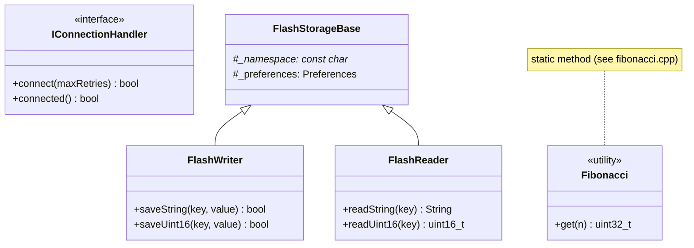
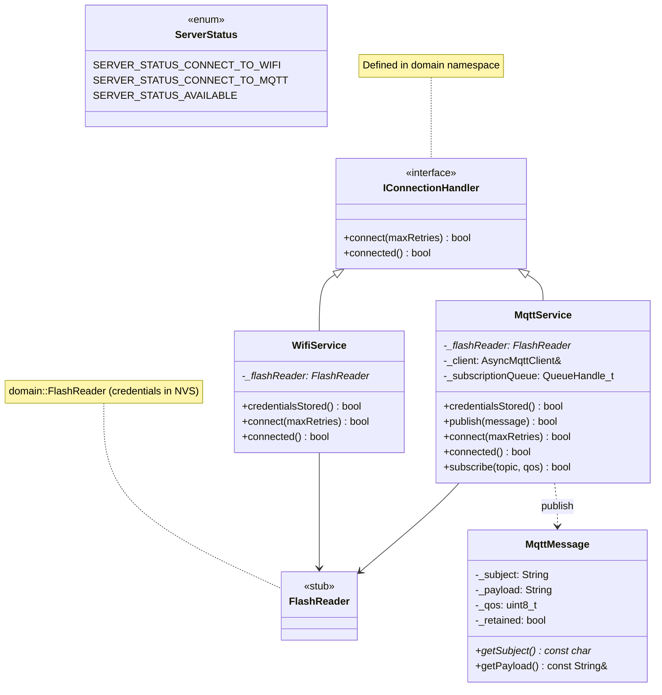
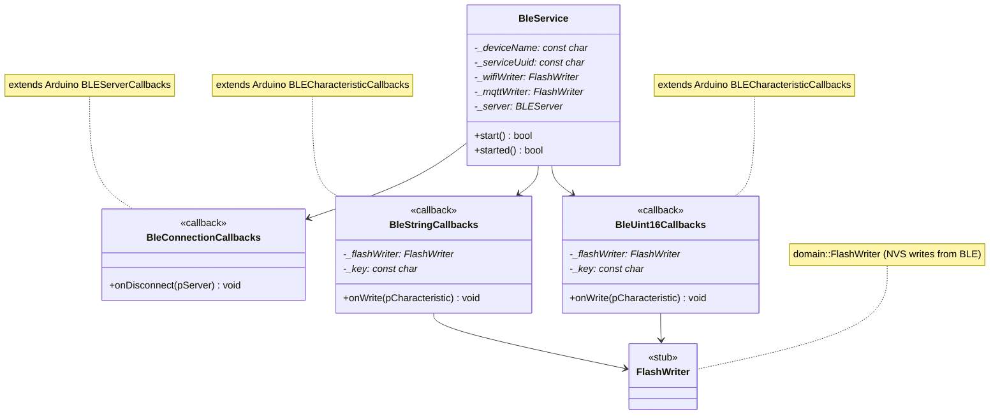
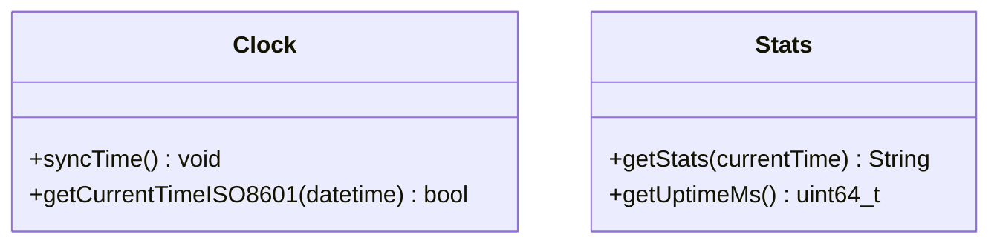
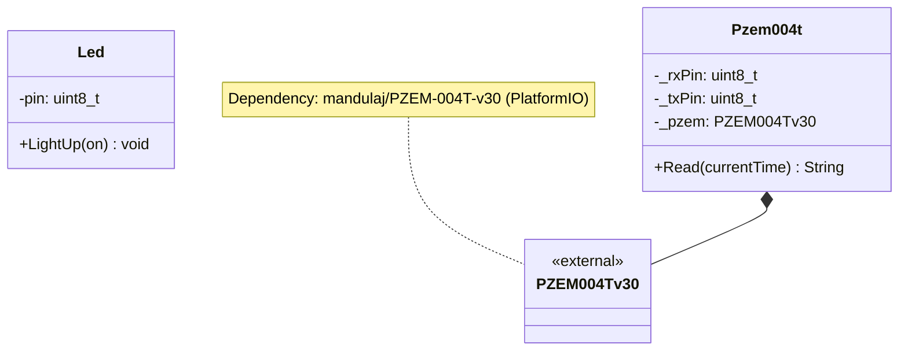
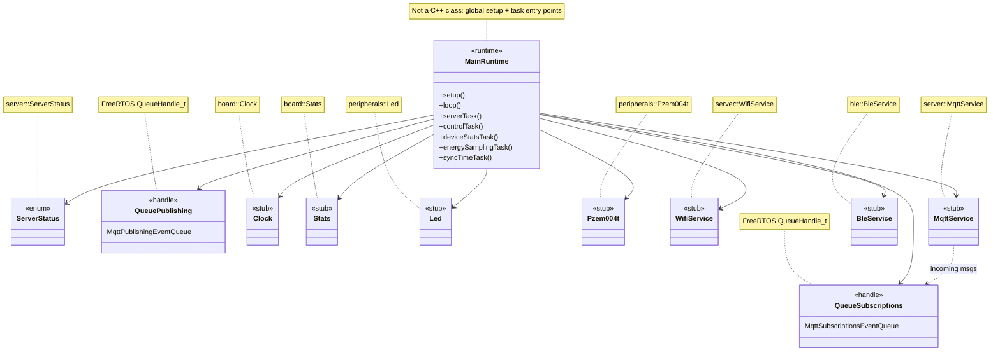
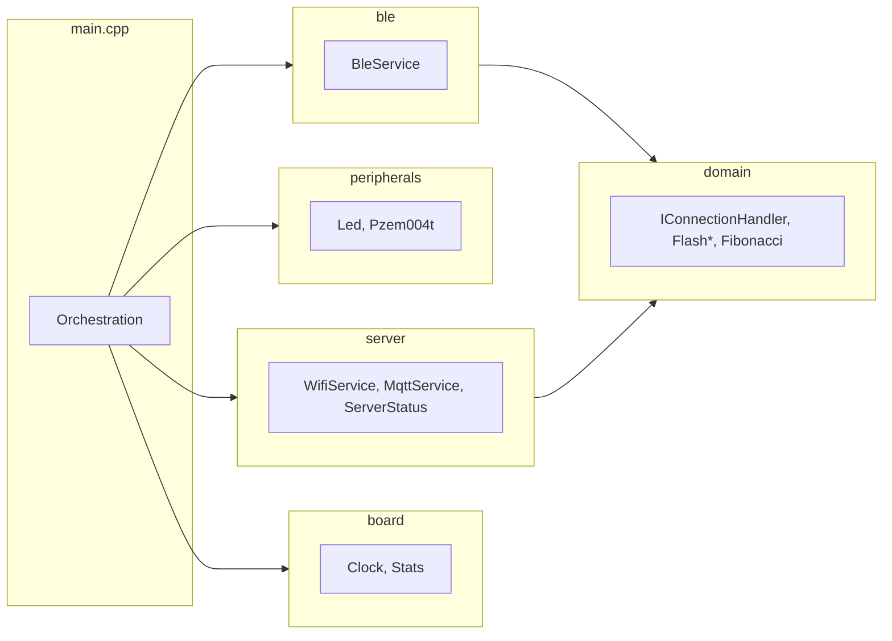

# Class Diagram

Class and interface relationships in `alpha`, **split by source folder** (`src/domain`, `src/server`, etc.) so each diagram stays easy to read. Types from other modules appear as stubs or notes where a relationship must be shown.

**Rendering note:** Mermaid parses `<<`…`>>` as stereotypes. Avoid spaces, `+`, `/`, or long text inside them (that can split `<<` / `>>` in the UI). Details go in `note for ClassName "..."` lines instead.

---

## `src/domain`

Connection contract, NVS helpers, and retry backoff.

---

## `src/server`

WiFi/MQTT services, MQTT DTO, and `ServerStatus`. `WifiService` and `MqttService` implement `IConnectionHandler` from `domain`; both use `FlashReader` for credentials.

---

## `src/ble`

BLE provisioning server and characteristic callbacks. Callbacks write credentials through `FlashWriter` (`domain`).

---

## `src/board`

Device clock (NTP) and JSON device statistics.

---

## `src/peripherals`

Onboard LED and PZEM-004T wrapper around the vendor library type.

---

## `src/main.cpp` (runtime wiring)

Global orchestration: tasks, queues, and owned service pointers.

---

## Module dependency overview

How source folders depend on each other (not every class shown). **`main.cpp` does not include or reference `domain/` directly**; it only pulls in `board`, `ble`, `peripherals`, and `server` headers. The `domain` module is used inside `ble` and `server`.

