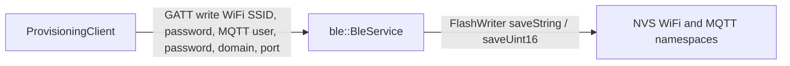
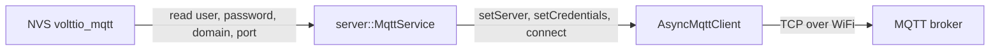
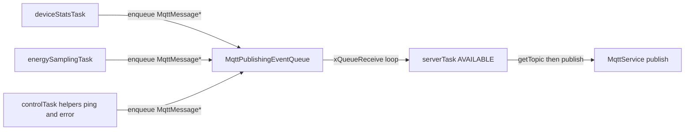
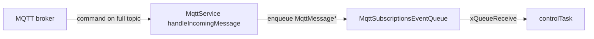

# Network Diagram

Network-related behavior in `alpha` is split **by actor** so each diagram stays small. Together they cover the same ground as the old single “connectivity” view.

| Section | Actor / concern |
|---------|-----------------|
| [BLE provisioning](#1-ble-provisioning) | External tool writes WiFi/MQTT credentials over BLE into NVS. |
| [WiFi link](#2-wi-fi-link) | Device reads WiFi credentials and joins an access point. |
| [MQTT session](#3-mqtt-session-to-broker) | Device reads MQTT credentials, opens a TCP session, subscribes to commands. |
| [MQTT outbound](#4-mqtt-outbound-publish-path) | Tasks enqueue telemetry; `serverTask` publishes; topic strings use `getBaseTopic()` + subject. |
| [MQTT inbound](#5-mqtt-inbound-command-path) | Broker sends commands; `controlTask` dispatches after decode. |

---

## 1. BLE provisioning

**Actor:** provisioning app or tool on the phone/laptop. **On device:** `ble::BleService` and NVS writers (no WiFi/MQTT traffic yet).

Credentials are later read by `WifiService` / `MqttService` from the same NVS keys (see `src/domain/flash_memory.cpp`).

---

## 2. Wi-Fi link

**Actor:** `server::WifiService` under the `serverTask` state machine (`SERVER_STATUS_CONNECT_TO_WIFI`). **Dependency:** WiFi SSID must exist in NVS (often after BLE provisioning).

`serverTask` calls `wifi->connect()` until connected or max retries; see `src/main.cpp` and `src/server/wifi_.cpp`.

---

## 3. MQTT session to broker

**Actor:** `server::MqttService` + `AsyncMqttClient` after WiFi is up (`SERVER_STATUS_CONNECT_TO_MQTT` → `SERVER_STATUS_AVAILABLE`). **Dependency:** MQTT user, domain, and port in NVS (`credentialsStored()` in `mqtt.cpp`).

On success, `serverTask` subscribes to command subjects (`restart`, `ping`) and marks the server available; see `src/main.cpp` `serverTask` and `mqtt.cpp` `subscribe`.

---

## 4. MQTT outbound (publish path)

**Actors:** `deviceStatsTask`, `energySamplingTask`, `controlTask` (responses), and **`serverTask`** as the only path that calls `mqtt->publish`. **Shared resource:** `MqttPublishingEventQueue`.

**Topic strings:** `MqttService::publish()` turns each message into a broker topic with `getTopic(message->getSubject())`, i.e. **`fullTopic` = `getBaseTopic()` + `subject`** (`src/server/mqtt.cpp`).  
`getBaseTopic()` is `/` + `PROJECT_NAME` + `/` + `DEVICE_ID` + `/` (`config.h`, `secrets.h`). The `subject` is the short string passed to `MqttMessage` (see `config.h` macros below).

| Producer in firmware | `subject` (suffix on broker) |
|----------------------|------------------------------|
| `deviceStatsTask` | `device-stats` (`MQTT_SUBJECT_DEVICE_STATS`) |
| `energySamplingTask` | `energy-stats` (`MQTT_SUBJECT_ENERGY_STATS`) |
| `ping()` (from `controlTask`) | `pong` (`MQTT_SUBJECT_PING`) |
| `commandNotSupported()` | `error` (`MQTT_SUBJECT_ERROR`) |

Command topics (`restart`, `ping`) use the **same prefix** on the wire but are **not** sent through this queue—they are subscribed in §3 and handled in [§5](#5-mqtt-inbound-command-path).

`*` = pointer to `server::MqttMessage` (see `src/main.cpp`).

---

## 5. MQTT inbound (command path)

**Actors:** MQTT broker (other clients publish commands), **`AsyncMqttClient` `onMessage`** in `MqttService`, **`MqttSubscriptionsEventQueue`**, **`controlTask`**.

Incoming payload is reassembled in `handleIncomingMessage` before enqueue (`src/server/mqtt.cpp`). `controlTask` compares `message->getSubject()` to `restart` and `ping` (`config.h`).
